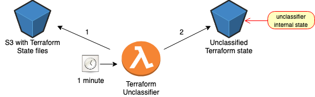

# Teraform Unclassifier is an automatic solution for removing classified and sensitive data from Terraform state files

Terraform state files sometimes contain "classified" or sensitive information like certificates and secrets. This makes the state files sensitive and preventing from sharing them. Terraform Unclassifier was created to allow TF users to share their state files with confidence, and without worrying about sensitive data being exposed. Terraform Unclassifier automatically scans TF state files and removes sensitive data.

### Deploy Terraform Unclassifier to your AWS account
] 

Terraform Unclassifier is easy to use; in order to "unclassify" your TFstate files you'll have to follow these steps:
1.  Click
    .
2.  In **Select Template**, click **Next** (no need to make a
    selection)
3.  In **Parameters**, insert the name of the S3 Bucket which stores the classified .tfstate files, *InputS3Bucket*, then click **Next**
4.  In **Options** page, click **Next** (no need to make any
    selections)
5.  In **Review** page, select the following options:
`I acknowledge that AWS CloudFormation might create IAM resources with custom names.`
6.  Click **Create Stack**

### Set Terraform Unclasifier Arguments
You can control terraform-unclassifier with these parameters:

| Parameter | Description | Optional/Mandatory |
| ------ | ------ | ----- |
| INPUT_BUCKET | Existing S3 Bucket containing sensitive terraform files | Mandatory |
| OUTPUT_BUCKET | S3 Bucket you wish Terraform-unclassifier to write the newunclassified state file | Mandatory |
| CLASSIFIED_TYPES | Terraform resources to remove (unclassify). Multi resources split by ","  Default value is aws_acm_certificate | Optional |
| OUTPUT_DELIMITER | Defines the output delimiter in Output S3 Bucket | Optional |
| TERRAFORM_STATE_SUFFIX | Defines terraform state files sufix Default value is .tfstate | Optional |
| HARD_REFRESH | Unclassifing all .tfstate files (even if if they already unclassified) Default value is false | Optional |

## Supported Terraform Versions
- 0.11.X
- 0.12.X
- 0.13.X
- 0.14.X

## Unclassifier is currently supported in N.Virginia (us-east-1)

License
----
Apache 2.0
